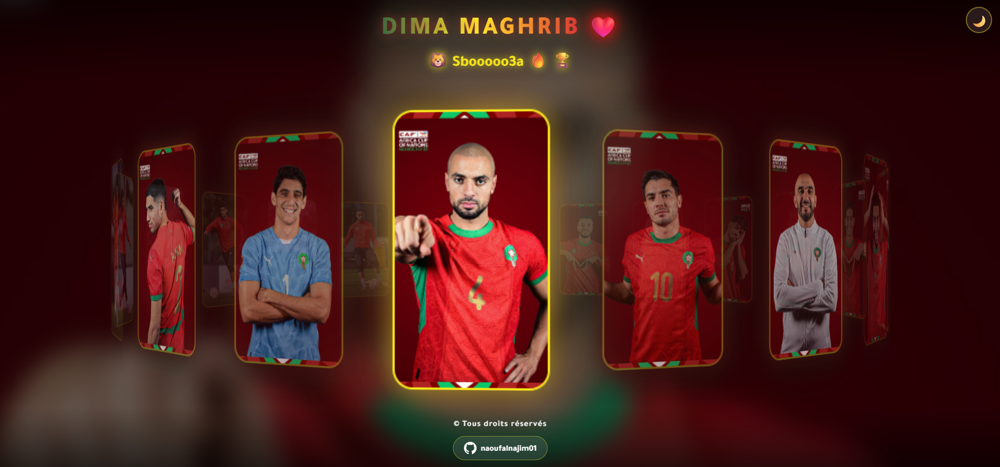

<div align="center">

# 🇲🇦 Morocco Squad 3D - الأسود الأطلس



### 🏆 CAN AFCON 2025 Special Edition 🏆

[](https://naoufalnajim01.github.io/Morocco-Squad-3D)
[](https://github.com/naoufalnajim01)
[](LICENSE)

**Une galerie 3D interactive célébrant les Lions de l'Atlas 🦁**

**[English](README.en.md)** | **[العربية](README.ar.md)** | **Français**

---

</div>

## 🎯 À Propos

**Morocco Squad 3D** est une expérience web interactive créée pour célébrer l'équipe nationale marocaine de football à l'occasion de la **CAN AFCON 2025**. Ce projet présente les joueurs des Lions de l'Atlas dans un carrousel 3D immersif avec des effets visuels modernes.

### ✨ Fonctionnalités

- 🎨 **Carrousel 3D Interactif** - Navigation fluide avec rotation automatique
- 🌓 **Mode Sombre/Clair** - Thème adaptatif avec détection automatique
- 📱 **100% Responsive** - Compatible mobile, tablette et desktop
- 🎭 **Effets Glassmorphism** - Design moderne avec effets de verre
- 🖼️ **Background Dynamique** - Arrière-plan qui change selon le joueur actif
- ⚡ **Performance Optimisée** - Animations fluides à 60 FPS
- 🎮 **Contrôles Intuitifs** - Drag & drop, hover, et support tactile

### 🎥 Démo Vidéo

https://github.com/user-attachments/assets/demo.mp4

## 🚀 Technologies Utilisées

```
HTML5        ████████████████████  100%
CSS3         ████████████████████  100%
JavaScript   ████████████████████  100%
```

- **HTML5** - Structure sémantique
- **CSS3** - Animations 3D, Glassmorphism, Variables CSS
- **Vanilla JavaScript** - Logique interactive sans framework
- **Google Fonts** - Typographie Tajawal (arabe)

## 📸 Aperçu

<div align="center">


</div>

## 🎮 Comment Utiliser

### Installation Locale

```bash
# Cloner le repository
git clone https://github.com/naoufalnajim01/Morocco-Squad-3D.git

# Naviguer dans le dossier
cd Morocco-Squad-3D

# Ouvrir index.html dans votre navigateur
# Ou utiliser un serveur local (recommandé)
python -m http.server 8000
# Puis visiter http://localhost:8000
```

### Contrôles

- **🖱️ Souris** - Cliquez et glissez pour faire tourner le carrousel
- **👆 Hover** - Survolez une carte pour la centrer automatiquement
- **📱 Tactile** - Swipe pour naviguer sur mobile
- **🌓 Toggle** - Cliquez sur le bouton en haut à droite pour changer le thème

## 🏗️ Structure du Projet

```
Morocco-Squad-3D/
├── index.html          # Page principale
├── style.css           # Styles et animations
├── script.js           # Logique JavaScript
├── demo.mp4            # Vidéo de démonstration
├── demo.png            # Image d'aperçu
├── README.md           # Documentation (Français)
├── README.en.md        # Documentation (English)
├── README.ar.md        # Documentation (العربية)
└── src/
    └── images/         # Photos des joueurs (20 images)
```

## 🦁 Liste Complète des 28 Joueurs - CAN 2025

<div align="center">

### 🧤 Gardiens (3)

| Joueur |
|--------|
| Yassine Bounou |
| Munir El Kajoui |
| El Mehdi Al Harrar |

### 🛡️ Défenseurs (9)

| Joueur |
|--------|
| Achraf Hakimi |
| Mohamed Chibi |
| Jawad El Yamiq |
| Romain Saïss |
| Abdelhamid Ait Boudlal |
| Nayef Aguerd |
| Adam Massina |
| Noussair Mazraoui |
| Anass Salah-Eddine |

### ⚡ Milieux de Terrain (7)

| Joueur |
|--------|
| Oussama Targhalline |
| Sofyan Amrabat |
| Ismaël Saibari |
| Neil El Aynaoui |
| Bilal El Khannouss |
| Azzedine Ounahi |

### ⚽ Attaquants (8)

| Joueur |
|--------|
| Brahim Díaz |
| Ilias Akhomach |
| Chemsdine Talbi |
| Youssef En-Nesyri |
| Ayoub El Kaabi |
| Soufiane Rahimi |
| Abdessamad Ezzalzouli |
| Eliesse Ben Seghir |

### 🔄 Réservistes (2)

| Joueur |
|--------|
| Hamza Igamane |
| Youssef Belammari |

</div>

## 🏆 CAN AFCON 2025

Ce projet a été créé spécialement pour célébrer la participation du Maroc à la **Coupe d'Afrique des Nations 2025**. 

### 🇲🇦 Dima Maghrib! ❤️

> *"Sbooooo3a! 🦁🔥🏆"*

## 🎨 Personnalisation

### Changer les Couleurs

Modifiez les variables CSS dans `style.css`:

```css
:root {
    --bg-primary: linear-gradient(135deg, #0a1a0f 0%, #1a0a0a 50%, #0a0a1a 100%);
    --card-border: rgba(248, 231, 28, 0.4);
    --glow-green: rgba(22, 91, 51, 0.5);
    --glow-red: rgba(187, 37, 40, 0.5);
}
```

### Ajouter des Joueurs

1. Ajoutez l'image dans `src/images/`
2. Ajoutez la carte dans `index.html`:
```html
<div class="card" data-index="20"></div>
```
3. Ajoutez le chemin dans `script.js`:
```javascript
const images = [
    // ... autres images
    'src/images/nouveau.jpg'
];
```

## 🤝 Contribution

Les contributions sont les bienvenues! N'hésitez pas à:

1. Fork le projet
2. Créer une branche (`git checkout -b feature/AmazingFeature`)
3. Commit vos changements (`git commit -m 'Add some AmazingFeature'`)
4. Push vers la branche (`git push origin feature/AmazingFeature`)
5. Ouvrir une Pull Request

## 📝 License

Ce projet est sous licence **MIT** - voir le fichier [LICENSE](LICENSE) pour plus de détails.

## 👨‍💻 Auteur

**Naoufal Najim**

-  Email: [naoufal.najim19@gmail.com](mailto:naoufal.najim19@gmail.com)
- 💼 LinkedIn: [linkedin.com/in/naoufalnajim01](https://linkedin.com/in/naoufalnajim01)
- 🐦 X/Twitter: [@naoufalnajim01](https://twitter.com/naoufalnajim01)
- 💻 GitHub: [@naoufalnajim01](https://github.com/naoufalnajim01)

## 🙏 Remerciements

- 🦁 **Les Lions de l'Atlas** - Pour l'inspiration
- 🇲🇦 **Équipe Nationale du Maroc** - Pour les moments inoubliables
- 🏆 **CAN AFCON 2025** - Pour la motivation
- ⚽ **Tous les supporters marocains** - Dima Maghrib!

---

<div align="center">

### 🌟 Si vous aimez ce projet, n'oubliez pas de lui donner une ⭐!

**Made with ❤️ for Morocco 🇲🇦**


</div>

---

## 📱 Contact

Pour toute question ou suggestion, n'hésitez pas à ouvrir une issue!

**Dima Maghrib! 🦁❤️🇲🇦**
